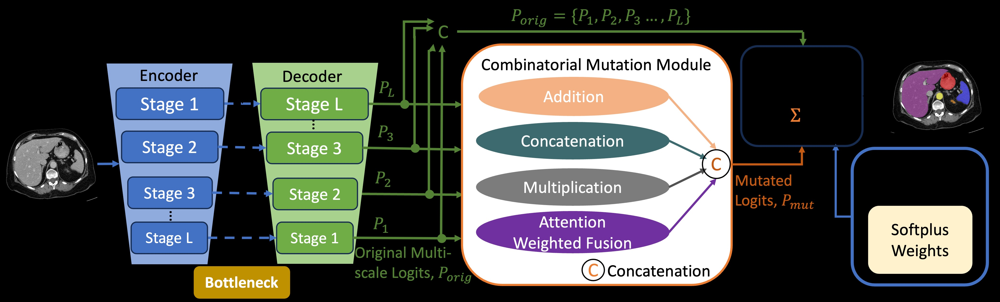

# LoMix
Official repository of NeurIPS 2025 paper [LoMix: Learnable Weighted Multi‑Scale Logits Mixing for Medical Image Segmentation](https://neurips.cc/virtual/2025/loc/san-diego/poster/119650).
<br>
[arxiv](https://arxiv.org/abs/2510.22995) <br>
[Md Mostafijur Rahman](https://github.com/mostafij-rahman), [Radu Marculescu](https://radum.ece.utexas.edu/)
<p>The University of Texas at Austin</p>

#### 🔍 **Check out our MICCAI 2025 paper! [EfficientMedNeXt](https://github.com/SLDGroup/EfficientMedNeXt)** 
#### 🔍 **Check out our CVPR 2025 paper! [EffiDec3D](https://github.com/SLDGroup/EffiDec3D)** 
#### 🔍 **Check out our ICCVW 2025 paper! [MK-UNet](https://github.com/SLDGroup/MK-UNet)**
#### 🔍 **Check out our CVPR 2024 paper! [EMCAD](https://github.com/SLDGroup/EMCAD)**
#### 🔍 **Check out our CVPRW 2024 paper! [PP-SAM](https://github.com/SLDGroup/PP-SAM)** 
#### 🔍 **Check out our WACV 2024 paper! [G-CASCADE](https://github.com/SLDGroup/G-CASCADE)**
#### 🔍 **Check out our MIDL 2023 paper! [MERIT](https://github.com/SLDGroup/MERIT)**
#### 🔍 **Check out our WACV 2023 paper! [CASCADE](https://github.com/SLDGroup/CASCADE)**

## LoMix Supervision

<p align="center">

</p>

## Quantitative Results

## Qualitative Results

## Usage:
### Recommended environment:
**Please run the following commands.**
```
conda create -n lomixenv python=3.8
conda activate lomixenv

pip install torch==1.11.0+cu113 torchvision==0.12.0+cu113 torchaudio==0.11.0 --extra-index-url https://download.pytorch.org/whl/cu113

pip install mmcv-full -f https://download.openmmlab.com/mmcv/dist/cu113/torch1.11.0/index.html

pip install -r requirements.txt

### Data preparation:
- **Synapse Multi-organ dataset:**
Sign up in the [official Synapse website](https://www.synapse.org/#!Synapse:syn3193805/wiki/89480) and download the dataset. Then split the 'RawData' folder into 'TrainSet' (18 scans) and 'TestSet' (12 scans) following the [TransUNet's](https://github.com/Beckschen/TransUNet/blob/main/datasets/README.md) lists and put in the './data/synapse/Abdomen/RawData/' folder. Finally, preprocess using ```python ./utils/preprocess_synapse_data.py``` or download the [preprocessed data](https://drive.google.com/file/d/1wvmw8DVyDKr5sOAFn5zUpfhbK4Vxjze4/view) and save in the './data/synapse/' folder. 
Note: If you use the preprocessed data from [TransUNet](https://drive.google.com/drive/folders/1ACJEoTp-uqfFJ73qS3eUObQh52nGuzCd), please make necessary changes (i.e., remove the code segment (line# 88-94) to convert groundtruth labels from 14 to 9 classes) in the utils/dataset_synapse.py. 

- **ACDC dataset:**
Download the preprocessed ACDC dataset from [Google Drive](https://drive.google.com/file/d/1CruCQ-jjvA97BX-LIYwXaRMLmp3DN9zc/view) and move into './data/ACDC/' folder.

- **Polyp datasets:**
Download the splited polyp datasets from [Google Drive](https://drive.google.com/drive/folders/1XyjNgmPqikGxCaOdP0i6Xzf3deDIpbCV?usp=share_link) and move into './data/polyp/' folder.

### Pretrained model:
You should download the pretrained PVTv2 model from [Google Drive](https://drive.google.com/drive/folders/1d5F1VjEF1AtTkNO93JwVBBSivE8zImiF?usp=share) or [PVT GitHub](https://github.com/whai362/PVT/releases/tag/v2), and then put it in the './pretrained_pth/pvt/' folder for initialization.

### Training:
```
cd into LoMix
python -W ignore train_synapse_lomix.py --root_path /path/to/train/data --volume_path path/to/test/data --encoder pvt_v2_b2 --supervision lomix        # replace --root_path and --volume_path with your actual path to data.

```

### Testing:
```
cd into LoMix 
```

## Acknowledgement
We are very grateful for these excellent works [timm](https://github.com/huggingface/pytorch-image-models), [EMCAD](https://github.com/SLDGroup/EMCAD), [CASCADE](https://github.com/SLDGroup/CASCADE), [MERIT](https://github.com/SLDGroup/MERIT), [G-CASCADE](https://github.com/SLDGroup/G-CASCADE), [PP-SAM](https://github.com/SLDGroup/PP-SAM), [PraNet](https://github.com/DengPingFan/PraNet), and [TransUNet](https://github.com/Beckschen/TransUNet), which have provided the basis for our framework.

## Citations

``` 
@inproceedings{rahmanlomix,
  title={LoMix: Learnable Weighted Multi-Scale Logits Mixing for Medical Image Segmentation},
  author={Rahman, Md Mostafijur and Marculescu, Radu},
  booktitle={The Thirty-ninth Annual Conference on Neural Information Processing Systems}
}
```
